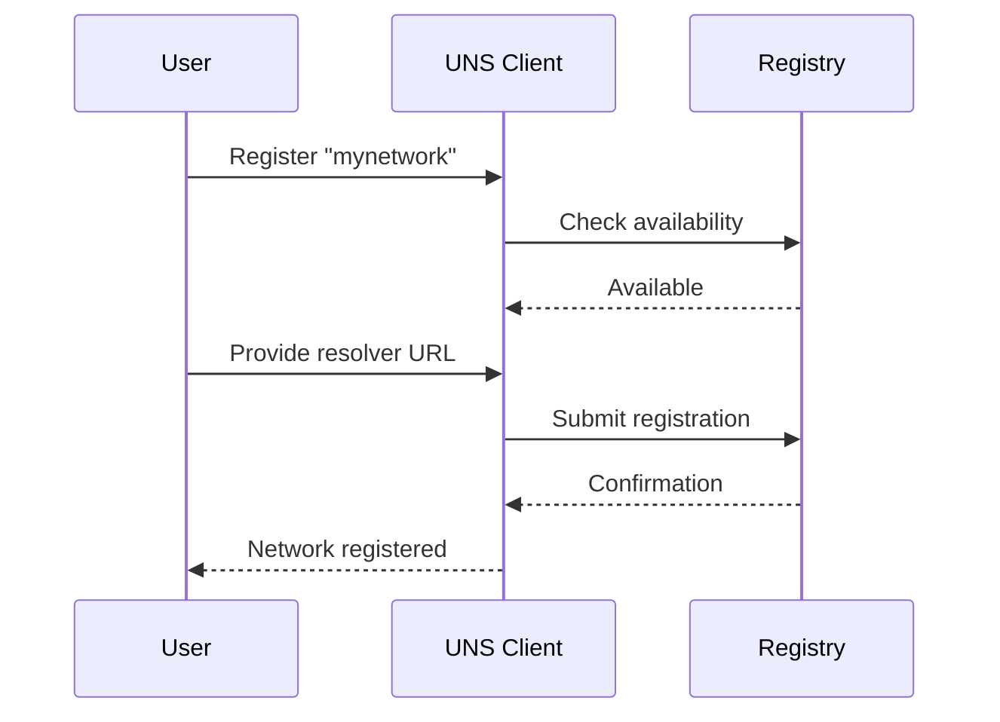
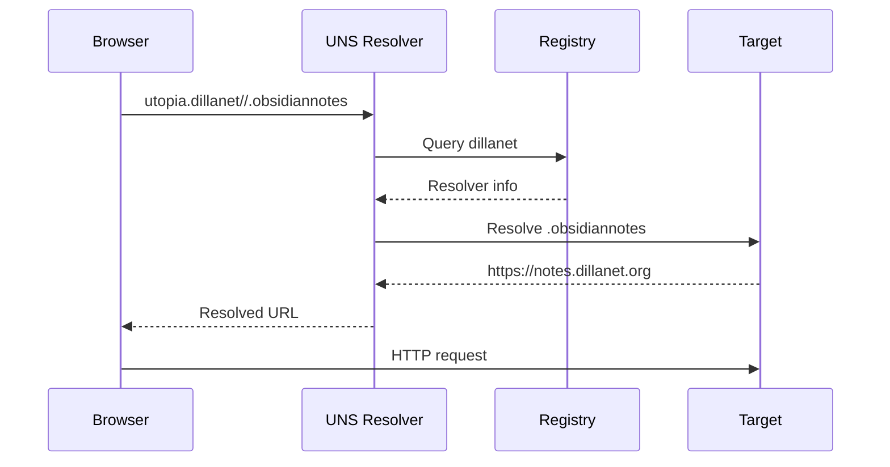

# Utopia Naming System (UNS) - Technical Specification

## 1. Overview

The Utopia Naming System (UNS) is a decentralized, free naming protocol that provides human-readable addressing for distributed resources. It aims to democratize namespace ownership while maintaining compatibility with existing web infrastructure.

### 1.1 Design Principles
- **Fully Decentralized**: No central authority controls namespace allocation
- **Free Access**: No fees, bidding, or auctions for namespace registration
- **Human-Readable**: Intuitive addressing scheme similar to traditional URLs
- **Extensible**: Support for various resource types and protocols
- **Self-Sovereign**: Users control their own namespaces and subdomains

## 2. Protocol Specification

### 2.1 Address Format
```
utopia.<network>//<path>
```

**Components:**
- `utopia`: Global root identifier (immutable)
- `<network>`: Community/personal namespace (alphanumeric, hyphens allowed)
- `//`: Protocol delimiter (separates network from resource path)
- `<path>`: Resource identifier within the network

### 2.2 Syntax Rules

#### Network Names
- **Length**: 3-63 characters
- **Characters**: a-z, 0-9, hyphens (not at start/end)
- **Case**: Lowercase only (case-insensitive resolution)
- **Reserved**: System reserved names (utopia, system, admin, root, etc.)

#### Path Components
- **Subdomain Format**: `.<subdomain>` (dot-prefixed)
- **Hierarchical Paths**: `/path/to/resource`
- **Query Parameters**: `?param=value`
- **Fragments**: `#section`

#### Valid Examples
```
utopia.dillanet//.obsidiannotes
utopia.dillanet//.nextcloud/files
utopia.chatgpt//.workspace?user=alice
utopia.alice//blog/2024/my-post#introduction
utopia.opensrc//.git/main
```

### 2.3 Resource Types

UNS addresses can resolve to:
- **HTTP/HTTPS endpoints**: Traditional web services
- **IPFS hashes**: Decentralized content
- **Local network resources**: LAN services
- **P2P identifiers**: Direct peer connections
- **Custom protocols**: WebRTC, BitTorrent, etc.

## 3. Architecture

### 3.1 System Components

```
┌─────────────────┐    ┌─────────────────┐    ┌─────────────────┐
│   Client Apps   │    │   UNS Resolver  │    │ Registry Network│
│                 │    │                 │    │                 │
│ • Browsers      │◄──►│ • Local Daemon  │◄──►│ • DHT Storage   │
│ • Mobile Apps   │    │ • DNS Plugin    │    │ • Blockchain    │
│ • CLI Tools     │    │ • Browser Ext   │    │ • IPFS/IPNS     │
└─────────────────┘    └─────────────────┘    └─────────────────┘
```

### 3.2 Resolution Flow

1. **Address Parsing**: Extract network and path components
2. **Cache Lookup**: Check local resolver cache
3. **Registry Query**: Query decentralized registry for network info
4. **Resource Resolution**: Map to actual resource location
5. **Caching**: Store result for future use
6. **Response**: Return resolved address to client

## 4. Implementation Strategies

### 4.1 Resolver Implementation Options

#### Option 1: Local Daemon
```bash
# UNS Resolver Daemon
uns-daemon --port=8053 --registry=dht --cache-ttl=3600
```

**Pros:**
- System-wide resolution
- Performance optimization
- Advanced caching
- Protocol flexibility

**Cons:**
- Installation complexity
- System privileges needed
- Background process management

#### Option 2: Browser Extension
```javascript
// Browser extension resolver
chrome.webRequest.onBeforeRequest.addListener(
  function(details) {
    if (details.url.startsWith('utopia.')) {
      return {redirectUrl: resolveUNS(details.url)};
    }
  },
  {urls: ["*://utopia.*/*"]},
  ["blocking"]
);
```

**Pros:**
- Easy installation
- No system changes
- User-controlled
- Cross-platform

**Cons:**
- Browser-specific
- Limited to web traffic
- Performance constraints

#### Option 3: DNS Integration
```
# DNS TXT record for network registration
_uns.dillanet.utopia.  TXT  "resolver=https://dillanet.org/uns"
```

**Pros:**
- Existing infrastructure
- Universal compatibility
- Caching benefits

**Cons:**
- DNS limitations
- Centralization concerns
- TTL constraints

### 4.2 Registry Implementation

#### Distributed Hash Table (DHT)
```json
{
  "network": "dillanet",
  "owner": "did:key:z6MkhaXgBZDvotDkL5257faiztiGiC2QtKLGpbnnEGta2doK",
  "resolvers": [
    "https://dillanet.org/uns",
    "ipfs://QmXyz123..."
  ],
  "subdomains": {
    ".obsidiannotes": "https://notes.dillanet.org",
    ".nextcloud": "https://cloud.dillanet.org"
  },
  "signature": "...",
  "timestamp": "2024-08-06T13:00:00Z"
}
```

#### Blockchain Registry
```solidity
// Ethereum smart contract example
contract UNSRegistry {
    mapping(string => NetworkInfo) public networks;
    
    struct NetworkInfo {
        address owner;
        string resolverURL;
        uint256 lastUpdate;
    }
    
    function registerNetwork(string memory name, string memory resolver) public {
        require(networks[name].owner == address(0), "Network already registered");
        networks[name] = NetworkInfo(msg.sender, resolver, block.timestamp);
    }
}
```

#### IPFS/IPNS Registry
```yaml
# IPNS record for network
network: dillanet
owner: 12D3KooWXYZ...
content_hash: QmABC123...
resolvers:
  - https://dillanet.org/uns
  - /ipfs/QmDEF456/resolver
subdomains:
  obsidiannotes: https://notes.dillanet.org
  nextcloud: https://cloud.dillanet.org
```

## 5. User Experience Flows

### 5.1 Network Registration



### 5.2 Subdomain Management

```bash
# CLI tool for subdomain management
uns subdomain add mynetwork .webapp https://myapp.com
uns subdomain list mynetwork
uns subdomain remove mynetwork .oldapp
```

### 5.3 Address Resolution



## 6. Security Considerations

### 6.1 Namespace Protection
- **Cryptographic Ownership**: Use public key cryptography for network ownership
- **Signature Verification**: All registry updates must be signed by owner
- **Time-based Validation**: Prevent replay attacks with timestamps
- **Multi-signature Support**: Allow shared ownership of networks

### 6.2 Resolution Security
- **HTTPS Enforcement**: Secure transport for resolver communications
- **Certificate Pinning**: Prevent man-in-the-middle attacks
- **Resolver Verification**: Validate resolver authenticity
- **Fallback Mechanisms**: Multiple resolvers for redundancy

### 6.3 Abuse Prevention
- **Rate Limiting**: Prevent spam registrations
- **Reputation System**: Community-based network validation
- **Dispute Resolution**: Mechanism for handling conflicts
- **Blocklists**: User-controlled filtering of malicious networks

## 7. Implementation Roadmap

### Phase 1: Core Protocol (3 months)
- [ ] Protocol specification finalization
- [ ] Reference resolver implementation
- [ ] Basic registry (DHT-based)
- [ ] CLI tools for registration/management
- [ ] Unit and integration tests

### Phase 2: User Tools (2 months)
- [ ] Browser extension development
- [ ] Mobile SDK
- [ ] Web-based management interface
- [ ] Documentation and tutorials

### Phase 3: Ecosystem (4 months)
- [ ] Alternative registry implementations
- [ ] Third-party resolver integrations
- [ ] Developer APIs and SDKs
- [ ] Community governance tools

### Phase 4: Advanced Features (3 months)
- [ ] Hierarchical namespaces
- [ ] Cross-network resolution
- [ ] Advanced security features
- [ ] Performance optimizations

## 8. Potential Challenges and Solutions

### 8.1 Adoption Challenges

**Challenge**: Network effects require critical mass of users
**Solutions:**
- Start with developer/tech communities
- Provide clear migration path from traditional domains
- Offer superior features (free, decentralized)
- Create compelling use cases

### 8.2 Technical Challenges

**Challenge**: Resolution performance vs. decentralization trade-off
**Solutions:**
- Multi-tier caching architecture
- Geographic resolver distribution
- Predictive prefetching
- Hybrid centralized/decentralized approach

**Challenge**: Namespace conflicts and squatting
**Solutions:**
- First-come-first-served with proof-of-use requirements
- Community governance mechanisms
- Alternative namespace schemes (.brand, .personal, .project)
- Reputation-based allocation

### 8.3 Interoperability Challenges

**Challenge**: Integration with existing web infrastructure
**Solutions:**
- DNS compatibility layer
- HTTP proxy mode
- Progressive enhancement approach
- Standard web API integration

## 9. Reference Implementation

### 9.1 Resolver API

```javascript
// UNS Resolver JavaScript API
class UNSResolver {
  async resolve(address) {
    const parsed = this.parseAddress(address);
    const networkInfo = await this.lookupNetwork(parsed.network);
    const resource = await this.resolveResource(networkInfo, parsed.path);
    return resource;
  }
  
  parseAddress(address) {
    const match = address.match(/^utopia\.([^\/]+)\/\/(.*)$/);
    if (!match) throw new Error('Invalid UNS address');
    return {
      network: match[1],
      path: match[2]
    };
  }
  
  async lookupNetwork(network) {
    // Query registry for network information
    return await this.registry.lookup(network);
  }
  
  async resolveResource(networkInfo, path) {
    // Contact network resolver to resolve resource
    const resolver = new NetworkResolver(networkInfo.resolverURL);
    return await resolver.resolve(path);
  }
}
```

### 9.2 Registry Interface

```javascript
// Registry interface
class UNSRegistry {
  async register(network, owner, resolverURL, signature) {
    // Validate signature and register network
  }
  
  async lookup(network) {
    // Return network information
  }
  
  async update(network, changes, signature) {
    // Update network information
  }
  
  async list(owner) {
    // List networks owned by address
  }
}
```

## 10. Conclusion

The Utopia Naming System represents a paradigm shift toward decentralized, user-controlled internet addressing. By combining familiar URL-like syntax with decentralized registry mechanisms, UNS can provide a foundation for a more open and democratic internet infrastructure.

Key success factors:
1. **Simplicity**: Easy-to-understand addressing scheme
2. **Flexibility**: Support for various resource types and protocols  
3. **Decentralization**: No single point of control or failure
4. **Compatibility**: Integration with existing web infrastructure
5. **Community**: Strong ecosystem and developer support

The modular architecture allows for incremental adoption and experimentation with different registry and resolution strategies, while the open protocol ensures long-term sustainability and evolution.
